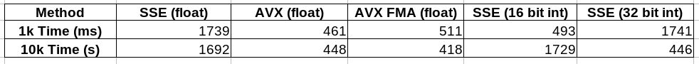
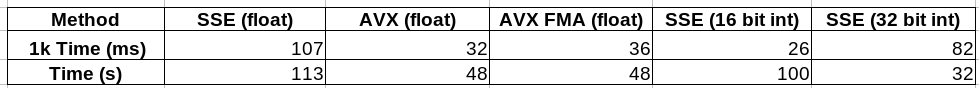

# Matrix Multiplication Benchmark

A repository for a project that seeks to improve cache oblivious and cpu extension oblivious implementation of matrix multiplications through the use of cache optimization as well as SIMD via SSE and AVX. 

## Goal:
Demonstrate visually the drastic speed-ups in performance that hardware acceleration can bring to computing problems.

## Background:
Matrix multiplication can essentially be broken down into four steps.  Take a row of index i from matrix 1, take a column of index j from matrix 2, then store in matrix 3 (result) the dot product of row i and column j into location (i, j). Rinse and repeat until matrix 3 is populated.
<p align="center">

</p>

Through various methodologies hardware may be used more efficiently which leads to improved compute times for matrix multiplication.

##  Results:
### Unoptimized:
<p align="center">
  
   
</p>

#### Large Matrix Test Results:
 

### Optimized:
<p align="center">
  
  
</p>

#### Large Matrix Test Results:
 


## Analysis

### Cache Awareness
Cache aware programming leads to a marked improvement over the standard single-core performance of matrix multiplication.  The implementation here implements cache 'blocking'.  Cache blocking involves computing a small square of values in the new matrix rather than scanning across rows and columns.  Blocking takes advantage of the fact that when the hardware reads from DRAM that it reads what is called one full cache-line.  A cache line (on x86-64) is 64 bits long.  This means that with a 32 bit data type, one read will result in a cache miss, and then a cache hit. For a 16 bit type, the speedup is four fold and will result in a cache miss followed by three consecutive hits.  Minimizing the amount of cache-misses reduces idle-cpu time in waiting.

### Hardware SIMD Extensions
Single Instruction Multiple Data (SIMD) extensions are extensions of the x86-64 ISA and allow programmers to increase throughput of common operations such as adding vectors together.  The hardware facillitates these extensions through the addition of large registers (128 and 256 bit) that can be loaded with multiple floating point or fixed point values. Depending on the data type, one can get up to 8x the throughput by using AVX (256 bit) or SSE (128 bit).

### GCC Optimizations
The GNU C Compiler provides a command line interface for specifying what optimizations it should perform on high-level-language code before assembling it.  In this implementation, optimized functions were tested side-by-side with their unoptimized counterparts.  This was done to compare their performance and to give an idea of just how much performance GCC can squeeze out of the code herein.  GCC optimizations result in a much faster large-matrix test for both floating and fixed point operations.  It is unknown what exactly GCC is doing to speed up these functions, but an educated guess could be that GCC is improving the cache awareness of the SIMD functions and therefore reducing cpu-idle time. 


It is very clear that making use of Single Instruction Multiple Data (SIMD) instructions is crucial to attaining maximum performance in matrix multiplication as the amount of instructions executed (and therefore CPU time) is decreased by an approximate factor of 2, 4, or 8 depending on the data type and extensions used.

## Methodology:
### Overview:
This project serves to be as flexible as possible, implementing a templated interface for a matrix data structure.  From a flexible container comes flexibility in computing and the top level data structure ```Matrix<T>``` was designed with this in mind.  Generality across arithmetic types was also achieved, but not at the expense of customization -- for this, template specializations are encouraged and are the basis for all of the hardware accelerations showcased within this project (see ```matrix.cpp``` and ```matrix.h```).

### Supported Types:
The container also works for any number of custom types given that they either overload ```operator*``` or implement a template specialization for multiplication in ```matrix.cpp``` By default, the container works with all arithmetic types defined by the C++ standard except boolean. See: https://en.cppreference.com/w/c/language/arithmetic_types

### Supported Platforms:
```Linux x64``` -- Preferably with AVX, SSE, SSE2 and FMA support. The application will automatically check and disable non-applicable feature sets.

```Windows``` is not supported at this time due to the differences between the way the MSVC and GNU C++ compilers handle intrinsics.  Support could easily be added by an individual who knows well SSE and AVX on Windows (to those interested: submit PR, submit issues, or fork the project).


### Installation and Testing
Clone the repository:  ```git clone https://github.com/tunnelsnake/ACS-Matrix-Benchmark.git```

Download GCC/G++ for your platform (if on WSL/Ubuntu/Debian:  ```sudo apt-get install g++```)

Enter the repository's directory with your terminal:  ```cd path/to/repository```

Run ```g++ matrix.cpp main.cpp -mavx -msse -mavx2 -mfma -g -o matrix.out``` to build the test executable

Run ```./matrix.out``` to run the test executable


