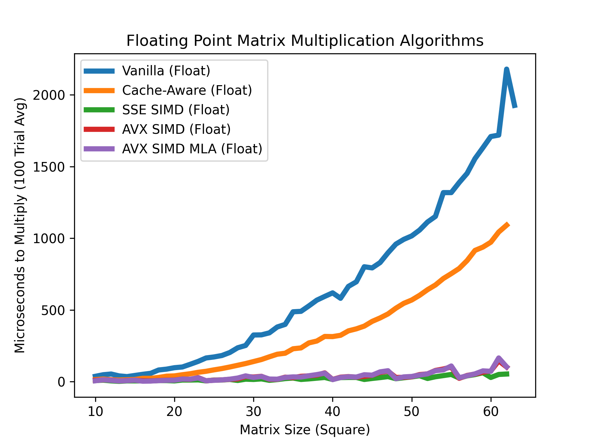

# Matrix Multiplication Benchmark

A repository for a project that seeks to improve cache oblivious and cpu extension oblivious implementation of matrix multiplications through the use of cache optimization as well as SIMD via SSE and AVX. 

## Goal:
Demonstrate visually the drastic speed-ups in performance that hardware acceleration can bring to computing problems.

## Results:
### Unoptimized:
<p align="center">
  
   
   
  <div style="width:200px">
    <table>
        <thead>
            <tr>
                <th>f|oo</th>
            </tr>
        </thead>
        <tbody>
            <tr>
                <td>b <code>|</code> az</td>
            </tr>
            <tr>
                <td>b <strong>|</strong> im</td>
            </tr>
        </tbody>
    </table>
  </div>

</p>

### Optimized:
<p align="center">
  
  
   

</p>
It is very clear that making use of Single Instruction Multiple Data (SIMD) instructions is crucial to attaining maximum performance in matrix multiplication.  Depending on the data type, one can get up to 8x the throughput by using AVX or SSE.


## Background:
Matrix multiplication can essentially be broken down into four steps.  Take a row of index i from matrix 1, take a column of index j from matrix 2, then store in matrix 3 (result) the dot product of row i and column j into location (i, j). Rinse and repeat until matrix 3 is populated.
<p align="center">

</p>

Any computer scientist could tell you that the time complexity of the multiplication of square matrices is ```O(n^3)```.

Through tried methodologies hardware may be used more efficiently which leads to improved compute times for matrix multiplication.

## Methodology:
### Overview:
This project serves to be as flexible as possible, implementing a templated interface for a matrix data structure.  From a flexible container comes flexibility in computing and the top level data structure ```Matrix<T>``` was designed with this in mind.  Generality across arithmetic types was also achieved, but not at the expense of customization -- for this, template specializations are encouraged and are the basis for all of the hardware accelerations showcased within this project (see ```matrix.cpp``` and ```matrix.h```).

### Supported Types:
The container also works for any number of custom types given that they either overload ```operator*``` or implement a template specialization for multiplication in ```matrix.cpp``` By default, the container works with all arithmetic types defined by the C++ standard except boolean. See: https://en.cppreference.com/w/c/language/arithmetic_types

### Supported Platforms:
```Linux x64``` -- Preferably with AVX, SSE, SSE2 and FMA support. The application will automatically check and disable non-applicable feature sets.

```Windows``` is not supported at this time due to the differences between the way the MSVC and GNU C++ compilers handle intrinsics.  Support could easily be added by an individual who knows well SSE and AVX on Windows (to those interested: submit PR, submit issues, or fork the project).


